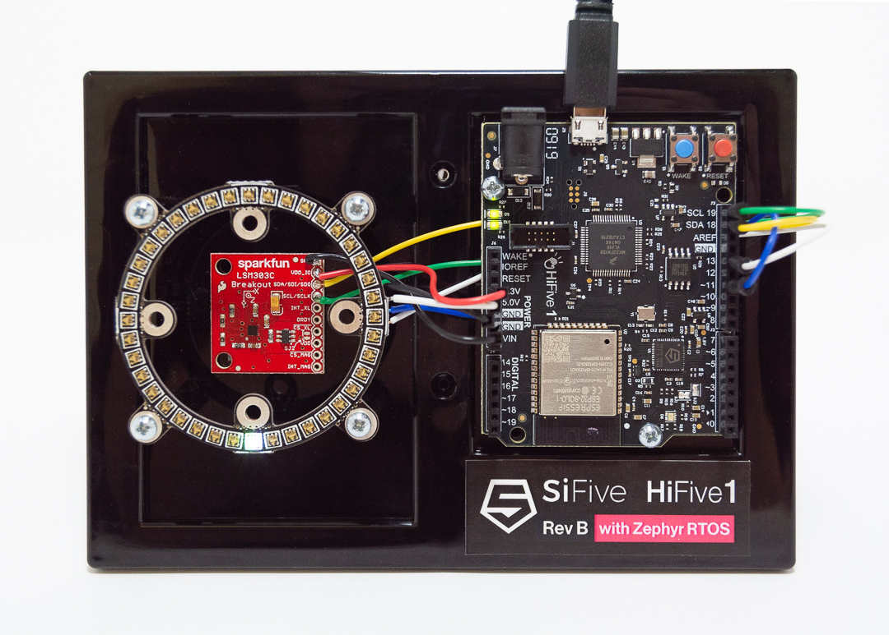

# HiFive1 Rev B Pendulum Demo

This repository contains a demo of the Hifive1 Rev B which demonstrates the
hardware I2C and SPI peripherals through a physics simulation.

## Building the Software

### With West

#### Prerequisites

- [Zephyr's dependencies](https://docs.zephyrproject.org/latest/getting_started/installation_linux.html#install-requirements-and-dependencies)
- [Zephyr SDK 0.10](https://docs.zephyrproject.org/latest/getting_started/installation_linux.html#install-the-zephyr-software-development-kit-sdk)
- [West](https://docs.zephyrproject.org/latest/getting_started/index.html#bootstrap-west)

#### Instructions

1. Clone this repository

        $ git clone --recursive https://github.com/sifive/hifive1-revb-pendulum.git && cd hifive1-revb-pendulum

2. Initialize West

        $ west init && west update

3. Build

        $ west build -b hifive1_revb pendulum

4. Plug in your HiFive1 Rev B and flash

        $ west flash

### Manually

#### Prerequisites

- [Zephyr's dependencies](https://docs.zephyrproject.org/latest/getting_started/installation_linux.html#install-requirements-and-dependencies)
- [Zephyr SDK 0.10](https://docs.zephyrproject.org/latest/getting_started/installation_linux.html#install-the-zephyr-software-development-kit-sdk)
- Ninja
- CMake >= 3.13.1
- [GNU RISC-V Embedded Toolchain](https://www.sifive.com/boards)

#### Instructions

1. Clone this repository

        $ git clone --recursive https://github.com/sifive/hifive1-revb-pendulum.git && cd hifive1-revb-pendulum

2. Set-up the shell environment

        $ source zephyr/zephyr_env.sh

3. Build

        $ make hex

4. Flash to the HiFive1 Rev B by plugging in the board and copying zephyr.hex
   to the USB mass storage device presented to your operating system.

## Building the Hardware

### Materials

- SiFive HiFive1 Rev B
- [Sparkfun LSM303C Breakout Board](https://www.sparkfun.com/products/13303)
- [Sparkfun LuMini LED Ring - 2 Inch](https://www.sparkfun.com/products/14966)
- [Arduino and Breadboard Holder](https://www.sparkfun.com/products/11235)
- [4 x 3/4" 4-40 Nylon Standoffs](https://www.sparkfun.com/products/11796)
- [4 x 1/2" 4-40 Screws](https://www.sparkfun.com/products/10452)
- [6 x 1/4" 4-40 Screws](https://www.sparkfun.com/products/10453)
- [Mini Breadboard](https://www.sparkfun.com/products/12047)
- 4+ pins of male header
- USB A-Micro B Cable
- Assorted wires

The mini breadboard and male headers weren't used in the demo photo (above),
but you might prefer to use them.

### Tools

- Drill/dremel tool for 4-40 clearance holes
- Soldering iron for LED Ring
- Screwdriver (Philips head)

### Instructions

1. Mark and drill the holes for the LED ring standoffs. Use the outer
   four mounting holes of the LED ring.
2. Adhere the mini breadboard between the standoffs.
3. Solder wires to the LED ring long enough to reach from the ring to
   the SPI 1 CLK and MOSI pins on the HiFive1.
4. Solder the male headers into the LSM303C breakout board.
5. Screw the LED ring onto the standoffs using four 1/2" screws from the
   bottom and four 1/4" screws from the top. To accomodate drilling error,
   do not tighten all the screws until all screws are loosely installed.
6. Screw down the HiFive1 using the remaining two 1/4" screws.
7. Place the LSM303C breakout in the mini breadboard
8. Plug VCC and GND for the LED ring into the HiFive1 5V and GND pins.
9. Plug VCC and GND for the LSM303C into the HiFive1 3.3V and GND pins.
10. Plug the LED ring DI pin into the SPI 1 MOSI pin on the HiFive 1.
11. Plug the LED ring CI pin into the SPI 1 CLK pin on the HiFive 1.
12. Plug the LSM303C SCL pin into the SCL pin on the HiFive 1.
14. Plug the LSM303C SDA pin into the SDA pin on the HiFive 1.
